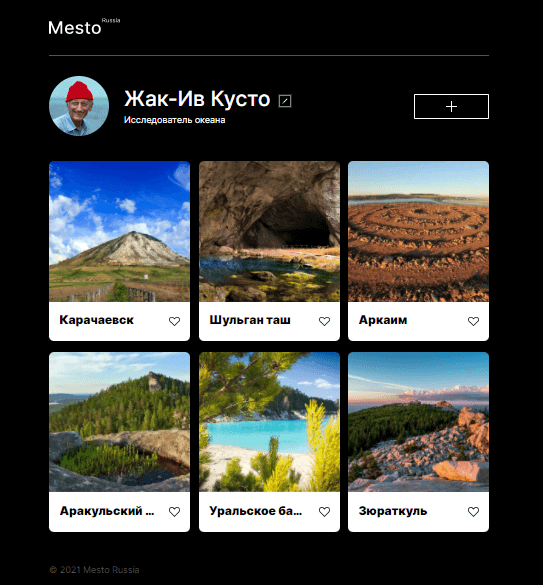

# Проект: Mesto

### Обзор
* Интро
* Технологии использованные в проекте

**Интро**

Проект Mesto: интерактивная страница, куда можно добавлять фотографии, удалять их и ставить лайки.

**Технологии использованные в проекте**
* React
* HTML 5
* CSS 3
* JavaScript
* BEM
* Webpack

**Ссылка на GitHub Pages**

* [Mesto](https://eldrabdr.github.io/react-mesto-auth/)

